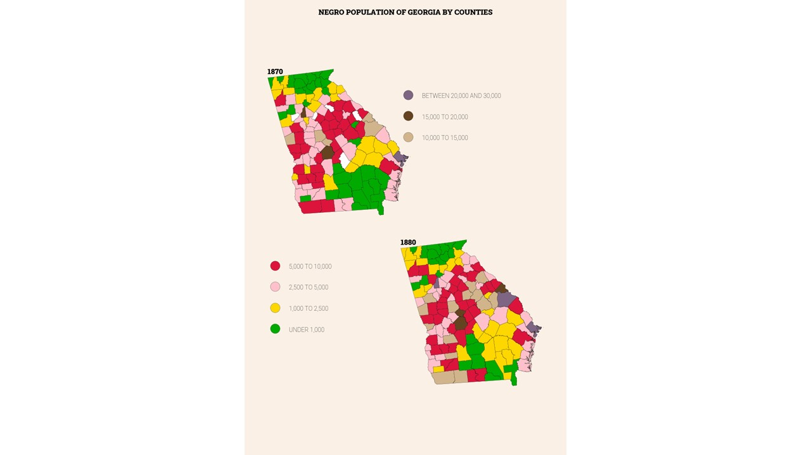
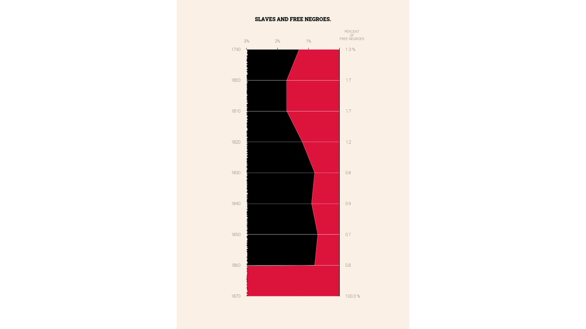
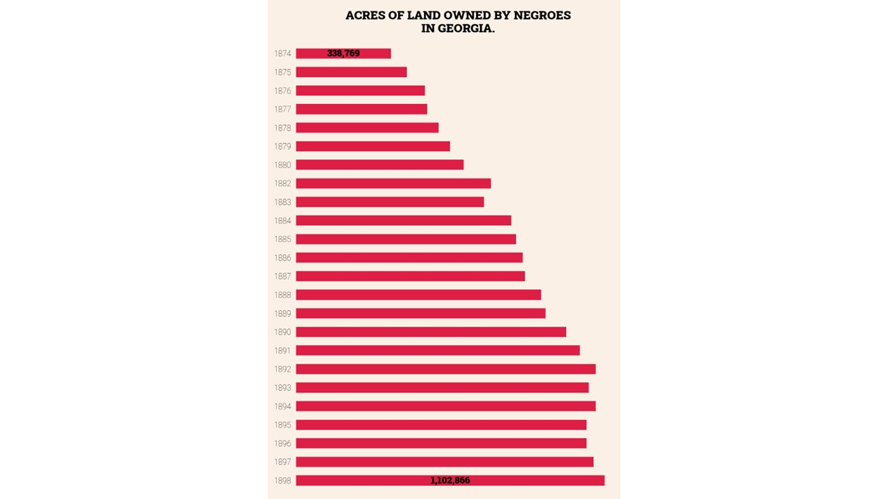
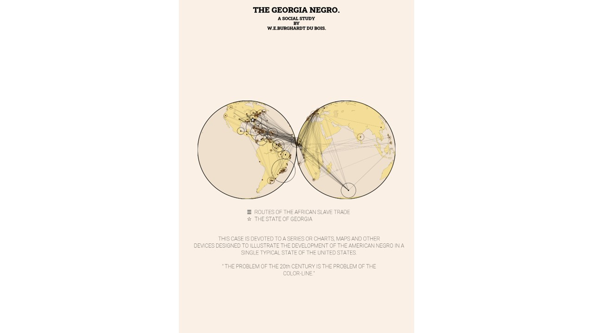
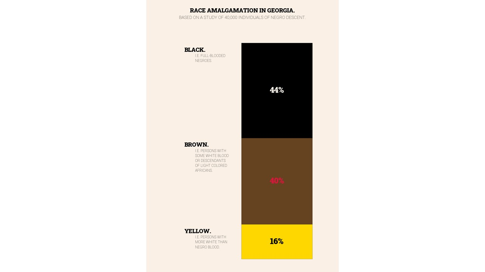
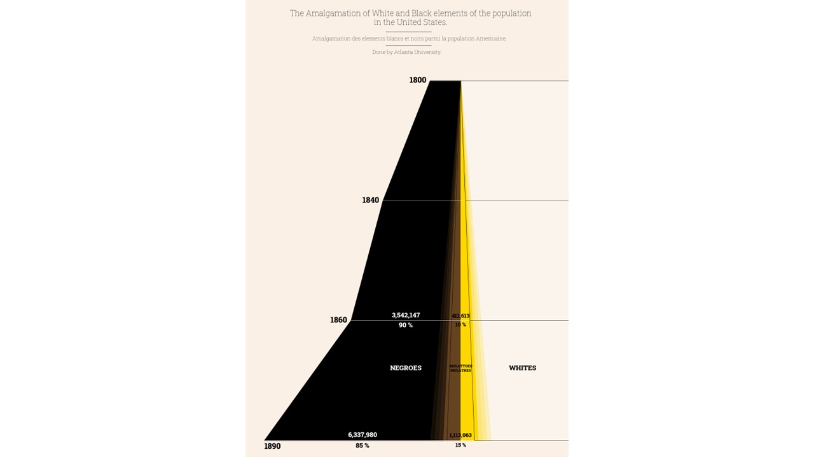
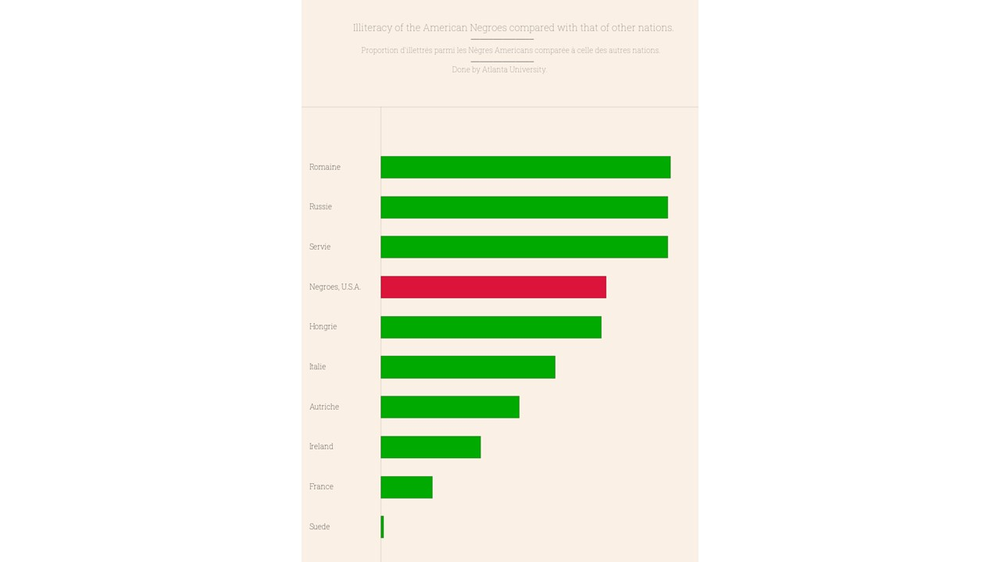
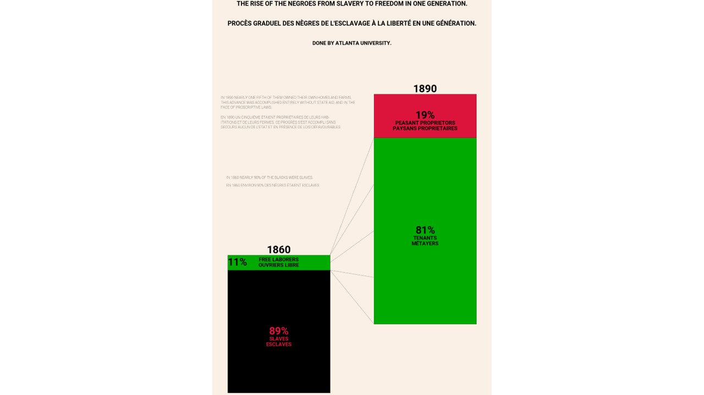
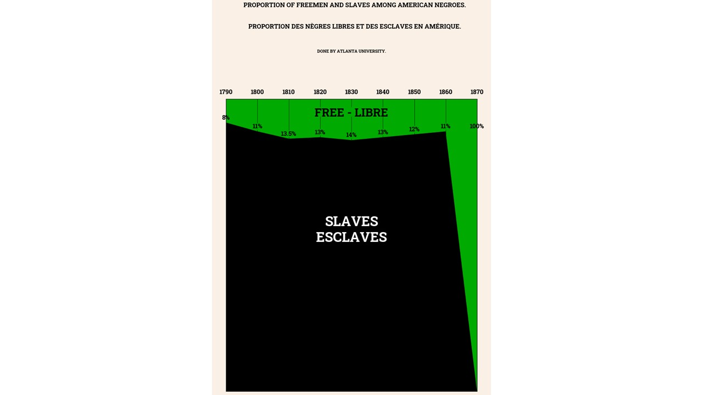
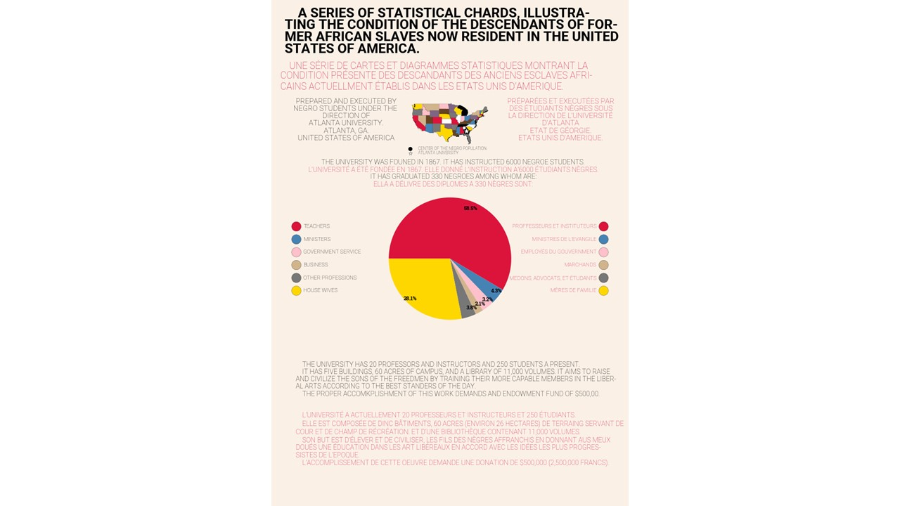

#  #DuBoisChallenge2024 using Python and Matplotlib

This repository contains a collection of notebooks. The notebooks show you how to recreate some of W.E.B. Du Bois's Data Portraits using Matplotlib. 

To get started, copy the `2024` folder from the [DVS Du Bois Data Challenge repo](https://github.com/ajstarks/dubois-data-portraits/tree/master/challenge) and add it to the root of this project.

I'm also keep track of my progress on [my personal blog](https://www.edriessen.com/2024/02/07/developing-du-boiss-data-portraits-with-python-and-matplotlib/).

## The 10 Du Bois Visualisations

You can view the visualisations made below. Each notebook shares the code and some explanations. Though some notebooks have a better structure than others. 

#### Challenge 01

#### Challenge 02

#### Challenge 03

#### Challenge 04

#### Challenge 05

#### Challenge 06

#### Challenge 07

#### Challenge 08

#### Challenge 09

#### Challenge 10

----

## Bonus

- `colors.py` - it includes a dictionary of the Du Bois colours by name as listed in the [style guide](https://github.com/ajstarks/dubois-data-portraits/blob/master/dubois-style.pdf). 
- `port_lookup.py` - it includes a dictionary with latitudes and longitudes for all the ports (Sources and Destinations) in the challenge 04 route pairs data, generated using [geopy](https://geopy.readthedocs.io/en/stable/#nominatim). 

## Contact

Any questions or suggestions? Don't hesitate to reach out. [Say hi here](https://www.edriessen.com/contact).

